# Spring Elastic POC

This project is a **Spring Boot** application that demonstrates the integration of **PostgreSQL** and **Elasticsearch** for managing and searching product data. It provides a REST API for CRUD operations and advanced search capabilities.

## Features

- **CR~~U~~D Operations**: Create, read, ~~update~~, and delete products.
- **Elasticsearch Integration**: Full-text search on product fields like name, description, and tags.
- **PostgreSQL Integration**: Persistent storage for product data.
- **Validation**: Input validation using `@Valid` annotations.
- **OpenAPI Documentation**: API documentation with Swagger UI.
- **Messaging**: Kafka-based messaging for syncing data between services.

## Technologies Used

- **Java 25**
- **Spring Boot**
- **PostgreSQL**
- **Elasticsearch**
- **Kafka**
- **MapStruct** for object mapping
- **Maven** for dependency management

## Prerequisites

- **Java 25+**
- **Docker** and **Docker Compose** (for running PostgreSQL, Elasticsearch, and Kafka)
- **Maven**

## Architecture

```mermaid
graph TD
    %% Client
    Client[Client / Frontend]

    %% Application
    subgraph SpringBootApp["Spring Boot Application"]
        API[REST Controllers]
        Service[Application Services]
        JPARepo[JPA Repository]
        ESRepo[Elasticsearch Repository]
        Producer[Kafka Producer]
        Consumer[Kafka Consumer]
        Mapper[Entity ↔ Document Mapper]
    end

    %% Datastores
    Postgres[(PostgreSQL)]
    Elasticsearch[(Elasticsearch)]
    Kafka[(Kafka Topic)]

    %% Write flow
    Client -->|HTTP POST/DELETE| API
    API --> Service
    Service --> JPARepo
    JPARepo --> Postgres

    %% Async sync flow
    Service -->|ProductCreated / Deleted| Producer
    Producer --> Kafka
    Kafka --> Consumer
    Consumer --> Mapper
    Mapper --> ESRepo
    ESRepo --> Elasticsearch

    %% Read flow
    Client -->|HTTP GET /search| API
    API --> Service
    Service -->|Search query| ESRepo
    ESRepo --> Elasticsearch
```



## Getting Started

### Clone the Repository

```bash
git clone https://github.com/renatompf/poc_spring_elasticsearch.git
cd poc_spring_elasticsearch
```

### Build the Project

```bash
mvn clean install
```

### Run the Application

By running the following command, the application will start along with PostgreSQL, Elasticsearch, and Kafka using Docker Compose:

```bash
make run
```

## Documentation

You can access the API documentation at:
```
http://localhost:8080/swagger-ui.html
```
or 
```
http://localhost:8080/api-docs
```

You will also find some pre-created requests in the [http folder](/http).
